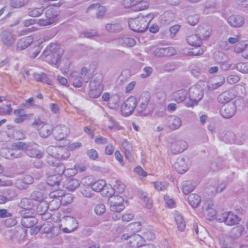
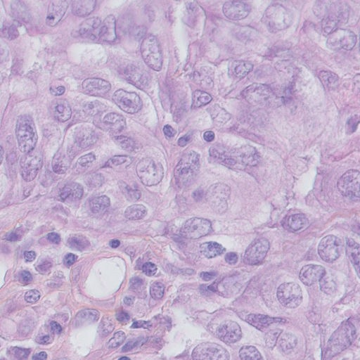
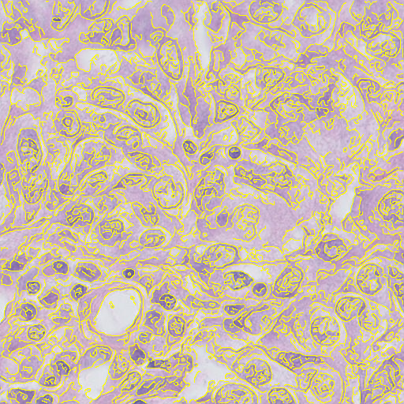

# Breast Cancer Image Segmentation
### Semantic Segmentation of Triple Negative Breast Cancer(TNBC) Dataset using U-Net CNN architecture
For main implementation see `Main.ipynb`

## Outline

1. [Introduction](#introduction)
   * [Triple Negative Breast Cancer](#triple-negative-breast-cancer)
   * [U-Net](#u-net)
2. [Dataset](#dataset)
3. [Results](#results)
   * [Model's prediction comparision on different datasets](comparision-of-model's-prediction-trained-on-standard-and-canny-"overlayed"-dataset)
   * [Activation Maps](activation-map)
4. [Getting Started](#getting-started)
   * [Requirements](#requirements)
   * [Installation](#installation)
   * [Dataset Directory Structure](#dataset-directory-structure)
5. [Deployments](#deployment)
6. [References](#references)

# Introduction
## Triple Negative Breast Cancer
*"Triple-negative breast cancer (TNBC) accounts for about 10-15%  of all breast cancers. These cancers tend to be more common in women younger than age 40, who are African-American.*

*Triple-negative breast cancer differs from other types of invasive breast cancer in that they grow and spread faster, have limited treatment options, and a worse prognosis (outcome)"*.  - **American Cancer Society**

Thus early stage cancer detection is required to provide proper treatment to the patient and reduce the risk of death due to cancer as detection of these cancer cells at later stages lead to more suffering and increases chances of death. **Semantic segmentation of cancer cell images can be used to improvise the analysis and diagonsis of Breast Cancer! This is such an attempt.**

## U-Net

U-Net is a State of the Art CNN architecture for Bio-medical image segmentation. *The architecture consists of a contracting path to capture context and a symmetric expanding path that enables precise localization.* It's a Fully Convolutional Network(FCN) therefore it can **work with arbitrary size images!** I've implemented an architecture similar to the original U-Net architecture, except I've used **"same"** padding instead **"valid"** which the authors have used. Using "same" padding throughout makes the output segmentation mask of same (height, width) as that of the input.


# Dataset        
### Sample image from the dataset

Original Image            |  Ground Truth Segmentation Label
:-------------------------:|:-------------------------:
  |  

### Sample image from the Canny edge "overlayed" dataset

Original Image            |  Canny Overlayed Image
:-------------------------:|:-------------------------:
  |  

# Results
### Comparision of model's prediction trained on Standard and Canny "overlayed" Dataset


**Note:** The text labels for 3rd and 4th(from the left) images above are swapped. Also Predicted Mask is for the model trained on the Original dataset, same for Binary mask.

***We can see that the prediction of model trained on the Canny dataset is better than the original dataset***.
The results are very good considering the fact that we had only 33 images our training dataset which is very limited!

### Activation Map 
These visuals are the Activation Maps aka activations or output of a given layer and channel of U-Net. These tell us **What the CNN is actually learning** and also gives users a sense of *other* Biological/Medical features in the image. 

Since I'm using 'jet' cmap therefore, red regions corresponds to high activation, blue for low and green/yellow for the middle ones.


As clearly seen above this filter has learnt to segment Cancer cells. The "overlayyed" image clearly distinguishes Cancer and non-Cancer cells.


This filter seems to have learnt to identify empty regions. The Cancer cells are maked in blue in the Activation Map, it's like this filter is **learning to ignore Cancer cells!** Things like this can really happen *despite the entire model is being trained to learn to segment Cancer cells.*

# Getting Started
I've documented and commented aggresively in all the modules and `Main.ipynb` thus following the code should be very easy. I've also included links to several discussions on stackoverflow, etc. so that you can get an in depth understanding of the working of the code. I've also included several plots which will help you in understanding the *training curve* and diagose possible errors which may creep in while training.
### Requirements
1. [TensorFlow_1.x](https://www.tensorflow.org/versions)
2. [Keras](https://keras.io/)
3. [Matplotlib](https://matplotlib.org/3.1.3/users/installing.html)
4. [Pillow](https://pypi.org/project/Pillow/)
5. [Numpy](https://pypi.org/project/numpy/)

**Note:** I'd suggest using [Google Colab](https://colab.research.google.com/notebooks/intro.ipynb) or [Kaggle Notebook](https://www.kaggle.com/notebooks) then you **don't need to worry about the set-up!** Plus you get ***free GPUs!***

### Installation
Clone this repo to your local machine using https://github.com/Adarsh-K/Breast-Cancer-Image-Segmentation.git
## Dataset Directory Structure
### Train/Test Dataset
Download the dataset from [here](https://zenodo.org/record/1175282#.Xl_4nZMzZQJ) and divide it into Train and Test/Validation dataset. I split into 33/17(arbitrary) you may use 70:30 split. Then arrange the splitted datasets as described below.

*train, images, label, img* are all directories and *img* has all the images/labels. The structure below is crucial for correct working of **ImageDataGenerator.flow_from_directory()** 

```bash
├── train
│   ├── images
│       ├── img
└── ├── label
        ├── img
```

Do the same for test dataset as well.
### Canny Edge Overlayed dataset
Here we are gonna produce a new dataset from the original dataset we downloaded above. Run `canny_edge_overlay.m` script. 

Example for training set at location say `/home/Desktop/train`:

```At line 7 change the file path from /Users/adarshkumar/Desktop/data1/test/images/img/%d.png -> /home/Desktop/train/images/img/%d.png
Also change end index of for loop to number of examples in train dataset
Note: Change file path at line 10 to where you want the Canny Edge "overlayed" images to be saved. 
```
Repeat the same steps for test dataset as well. As you might have already realised you require `MATLAB` for this but the **same can also be achieved** using [OpenCV: Canny Edge](https://docs.opencv.org/trunk/da/d22/tutorial_py_canny.html)
### Performance Evaluation Dataset
This dataset is essentially same as the Test dataset, but the dataset directory structure is quite different. *Reason explained* in `utils.py`. The structure should be as below:
 
 ```bash
├── test2
│   ├── 0
│       ├── 0
│           ├── 0.png
├── ├── 1
│       ├── 1
│           ├── 1.png
│ 
│ 
.
.
.
```

### Running Main.ipynb
Before you run the Main.py notebook you should change the path of directories(**test, train, test2**) accordingly in modules: **augmentation.py, utils.py, plots.py**. Now we're all set! Simply run the notebook `Main.ipynb` and fine-tune the Hyper-parameters(learning rate, epoaches, steps per epoches, etc.)

# Deployment
Training a model for any other task is pretty straight forward, simply change the train/test datasets according to your need and arrange it in the structure described above, then run `Main.ipynb`. ***The plots will help you diagonse possible errors***

You could **improve the performance on some other Bio-medical** task by using the weights saved for the original dataset in the 2 .hdf5 files we get after running `Main.ipynb` and use it as *pre-trained* weights for the other Bio-medical tasks. 
## References

1. [U-Net: Convolutional Networks for Biomedical Image Segmentation](https://arxiv.org/abs/1505.04597)
2. [Triple Negative Breast Cancer- American Cancer Society](https://www.cancer.org/cancer/breast-cancer/understanding-a-breast-cancer-diagnosis/types-of-breast-cancer/triple-negative.html)
3. [Deep Learning for Cancer Cell Detection and Segmentation: A Survey](https://www.researchgate.net/publication/334080872_Deep_Learning_for_Cancer_Cell_Detection_and_Segmentation_A_Survey)
4. [Transfusion: Understanding Transfer Learning for Medical Imaging](https://arxiv.org/abs/1902.07208)
5. [Dataset](https://zenodo.org/record/1175282#.Xl_4nZMzZQJ)

**Note:** Not an exhaustive list
